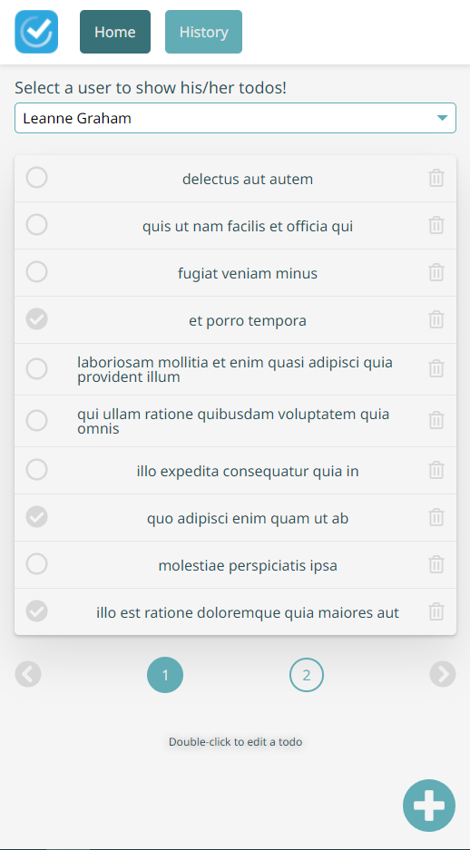
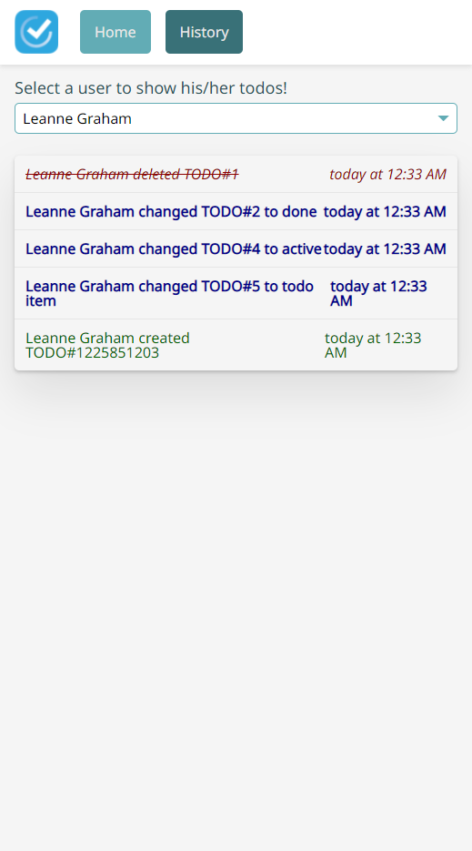

# Todo App

A simple todo app from Admin perspective. Admin can add, delete and update the todo items for selected user. Also Admin can track any change for any todo item (History Page).

## Screenshots




## Technology Stack

- **ReactJS** Project built from scratch (No CRA)
- **TypeScript**
- **Json-Server** for Fake APIs
- **i18next** for localization
- **Jest** & **React Testing Library**
- **Storybook** for Components Documentation
- **Sass** for styling

### Used Packages

- Axios
- classnames
- date-fns
- immer
- react-toastify
- yup
- react-icons
- react-helmet

## Environment Setup

Clone `.env.example` and make two copies, one of them rename it to `.env` and the other one to `.env.production`.

The `.env` file contains a key called `BASE_URL`, to run the project locally you should update this key with this value `"http://localhost:2022/api/"`

## Development

### Recommended Extensions (For VSCode Developers)

1.  [Prettier - Code formatter](https://marketplace.visualstudio.com/items?itemName=esbenp.prettier-vscode)
2.  [Jest Runner](https://marketplace.visualstudio.com/items?itemName=firsttris.vscode-jest-runner)
3.  [ESLint](https://marketplace.visualstudio.com/items?itemName=dbaeumer.vscode-eslint)
4.  [EditorConfig for VS Code](https://marketplace.visualstudio.com/items?itemName=EditorConfig.EditorConfig)
5.  [PostCSS Language Support](https://marketplace.visualstudio.com/items?itemName=csstools.postcss)
6.  [DotENV](https://marketplace.visualstudio.com/items?itemName=mikestead.dotenv)

### Main Project

1. NodeJS version is `16.14.x`
2. Clone the source code from `https://github.com/hamed-farag/todo.git`
3. In your terminal, navigate to the project directory and execute `npm install`
4. After the previous step, execute `npm run api` to run json-server for fake APIs.
5. In a new terminal instance, run `npm run start` to run the project locally.
6. Visit [http://localhost:3000](http://localhost:3000)

### Documentation (Storybook)

1. Run `npm run docs` and visit [http://localhost:6006/](http://localhost:6006)

### File Structure

```
.
├── __test__                            # all unit test
├── .storybook                          # contains all storybook needed setup files
├── .vscode                             # recommended extensions and default workspace setup
├── data                                # db.json and routes.json files that used by json-server
├── public                              # all assets needed in the project
├── screenshots
├── src
    ├── components                      # all reusable components
        ├── Business                    # all reusable components that server specific business
            ├── Users                   # users component is a dropdown list bonded with user data
        ├── UI
            ├── Dropdown
            ├── Empty
            ├── Label
            ├── Paginator
            ├── Spinner
            ├── Textbox
    ├── configs                         # all configs or shared configs
    ├── helpers
        ├── http
            ├── asyncer                 # manager for simplify the promise object
            ├── requester               # wrapper on top of the http library (axios)
        ├── logger                      # simple manager contains logging method
    ├── i18n                            # internationalization setup
    ├── interfaces                      # interfaces for typescript
    ├── Layouts                         # parent component for the pages, the layout as a wrapper for the pages with some styles and components
        ├── Main
            ├── components              # components used only for the Main Layout component
    ├── Pages
        ├── Home                        # the landing page that list the todo for the selected user
            ├── components              # components used only for the Home page component
        ├── History
            ├── components              # components used only for the Home page component
    ├── services                        # wrapper for http calls, also you can write here your business logic
    ├── stories                         # static files for the documentation tool (storybook)
    ├── styles                          # shared styles (7-1 sass architecture)
    ├── utils                           # small utilities for generating numbers, date, etc
    ├── app.styles.scss
    ├── App.tsx
    ├── index.tsx
```

## Endpoints

Check [SPECIFICATIONS.md](./SPECIFICATIONS.md) file

## Scripts

### Run APIs Locally via JSON-Server

`npm run api`

### Run Project Locally

`npm run start`

### Generate Dist folder for production

`npm run build`

### Run eslint for checking the project's files (Not Working fine)

`npm run lint`

### Run Storybook Locally

`npm run docs`

### Generate docs folder, for hosting as UI Framework Documentation

`npm run build:docs`

### Run Unit testing via Jest

`npm run test`

### Generate Coverage Report

`npm run coverage`

## Todo

1. Write more unit tests.
2. Dark Theme
3. Support Arabic & RTL
